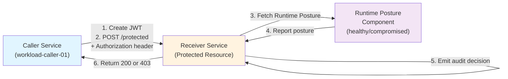
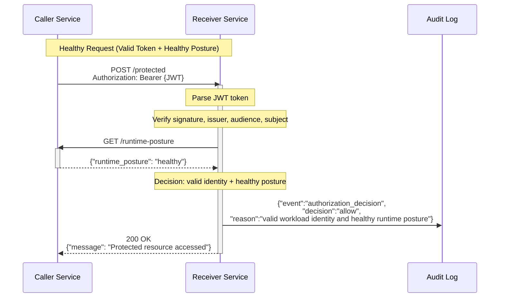
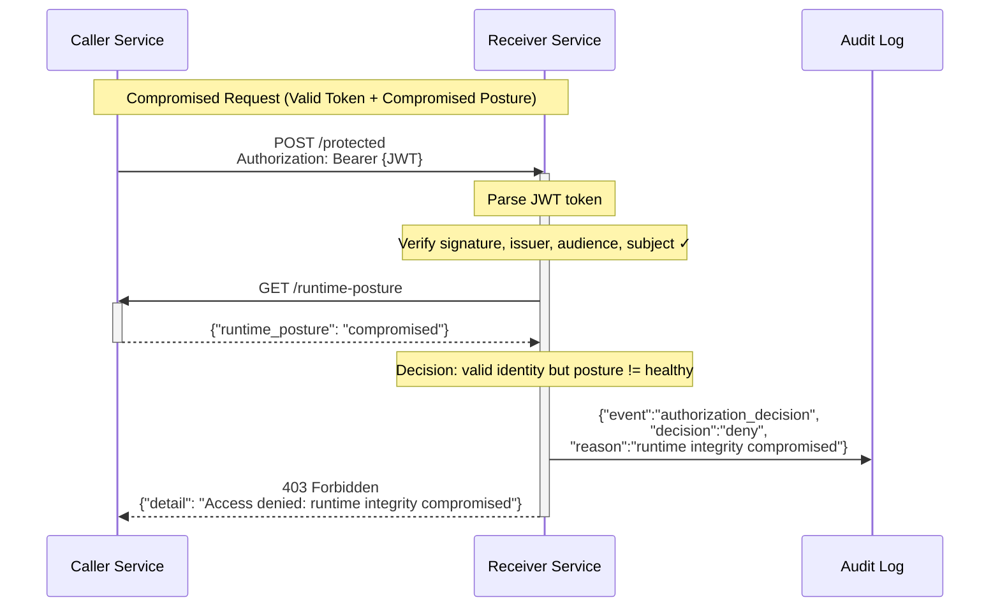
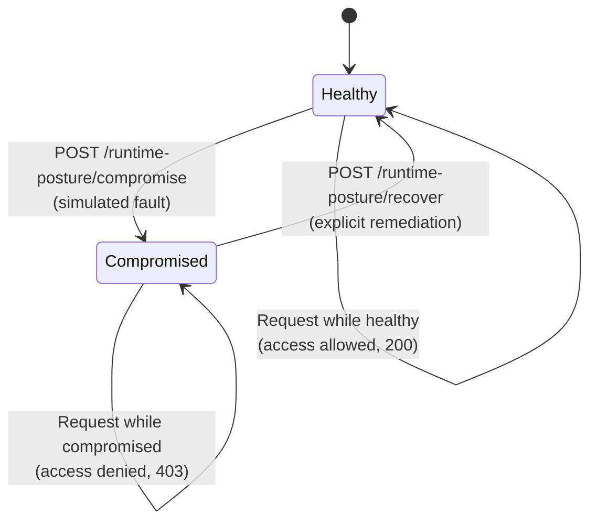
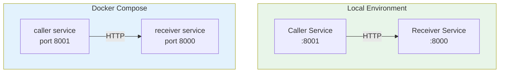

# Workload Identity Proof of Concept

A demonstration that service-to-service trust can dynamically respond to runtime integrity changes, not just initial authentication.

## Problem & Objective

### The Problem

Existing workload-identity solutions (mTLS, OIDC, bearer tokens, cloud-native IAM) successfully establish a workload's identity and execution context at startup. Once authenticated, they grant access for the lifetime of the credential—typically until expiration or manual revocation.

However, they provide no mechanism to detect and respond to runtime integrity degradation *after* authentication succeeds. A compromised workload may:
- Experience code injection or memory corruption
- Load malicious libraries
- Have secrets exfiltrated
- Execute unauthorized operations under its legitimate identity

**Today, identity systems answer "who is calling?", not "what state is the caller in?"**

### The Objective

This proof of concept validates a multi-pillar trust model where authorization depends not only on cryptographic identity, but also on continuous runtime-integrity evaluation. The system demonstrates that:
- Identity and runtime-integrity decisions are independent and auditable
- Access can be dynamically denied when integrity is compromised
- Recovery is explicit and requires re-evaluation

## Trust Model: Five Pillars

A trust decision is affirmative only if **all five pillars remain satisfactory**. Degradation in any pillar triggers re-evaluation and may result in access denial.

| Pillar | Description | Signal | Status in This POC |
|--------|-------------|--------|-------------------|
| **Software Integrity** | Binaries, libraries, and dependencies match expected cryptographic signatures; no unauthorized code modifications | SBOM attestation, code signing verification | Not implemented (out of scope) |
| **Execution Integrity** | Process runs with expected permissions, parent process, and runtime environment; no privilege escalation or container escape | UID, GID, parent PID, capabilities, seccomp status | Not implemented (out of scope) |
| **Runtime Integrity** | Continuous observation of memory, CPU, I/O, and network behavior; detection of anomalous operations and policy violations | Behavioral anomalies, security event triggers, system call policy violations | **Simulated locally** — explicit compromise/recovery endpoints; no real monitoring |
| **Identity and Access** | Caller's cryptographic identity (token, cert, key); confirmation that caller is authorized to perform the operation | JWT signature verification, subject/audience/issuer validation, ACL | **Implemented** — signed JWT with subject/audience/issuer checks |
| **Operational Trust** | Audit trail of trust decisions, access grants, and denials; compliance with organizational policy | Tamper-evident decision logs with reasoning | **Implemented** — JSON audit records in service logs |

## Architecture

### Logical View



### Process View: Authorization Flow

The receiver enforces a four-step trust decision on every request:

1. **Parse Bearer Token** → Extract JWT from Authorization header
2. **Verify Identity** → Validate JWT signature, issuer, audience, subject (HS256 HMAC)
3. **Fetch Runtime Posture** → Query caller's runtime-posture endpoint
4. **Emit Decision** → Log allow or deny with reason (identity failure or runtime-integrity failure)





### Runtime Posture State Diagram



### Development View

```
workload-identity-poc/
├── README.md                 # This document
├── requirements.txt          # Python dependencies (FastAPI, PyJWT, httpx, pytest)
├── docker-compose.yml        # Orchestration for local testing
│
├── caller/
│   └── app/
│       └── main.py           # Workload-caller-01: issues JWTs, simulates posture changes
│
├── receiver/
│   └── app/
│       └── main.py           # Protected resource: validates JWT + runtime posture
│
└── tests/
    └── test_auth_flow.py     # Integration tests (valid token, expired token, compromise, recovery)
```

**Key Responsibilities:**

- **caller/app/main.py** — JWT token issuer; manages runtime posture state (healthy/compromised/recovery)
- **receiver/app/main.py** — Access control enforcement; fetches caller posture; emits audit decisions
- **tests/test_auth_flow.py** — End-to-end validation of all four trust flows

### Deployment View



## Scenarios

### Scenario 1: Baseline Trust (Phase 1)

**Setup:** Both services running; runtime posture is `healthy`.

**Flow:**
1. Caller issues a JWT signed with the shared secret
2. Caller sends JWT in Authorization header to Receiver
3. Receiver validates JWT signature, issuer, audience, subject
4. Receiver fetches caller's runtime posture → `healthy`
5. Receiver grants access (200) and logs allow decision

**Expected Evidence:**
```json
{"event":"authorization_decision","decision":"allow","reason":"valid workload identity and healthy runtime posture","caller_identity":"workload-caller-01","runtime_posture":"healthy"}
```

### Scenario 2: Runtime Compromise & Denial (Phase 2)

**Setup:** Services running; caller posture is changed to `compromised`.

**Flow:**
1. Caller is marked as compromised via `POST /runtime-posture/compromise`
2. Caller sends same valid JWT to Receiver
3. Receiver validates JWT signature, issuer, audience, subject → **all pass**
4. Receiver fetches caller's runtime posture → `compromised`
5. Receiver denies access (403) and logs runtime-integrity failure

**Key Insight:** Identity pillar passes; runtime-integrity pillar fails → access denied.

**Expected Evidence:**
```json
{"event":"authorization_decision","decision":"deny","reason":"runtime integrity compromised","caller_identity":"workload-caller-01","runtime_posture":"compromised"}
```

### Scenario 3: Explicit Recovery (Phase 2)

**Setup:** Caller is compromised; access is being denied.

**Flow:**
1. Remediation occurs (e.g., service restart or security patch)
2. Caller posture is explicitly set to `healthy` via `POST /runtime-posture/recover`
3. Caller sends the same JWT to Receiver
4. Receiver validates JWT and posture → both healthy
5. Receiver grants access (200) and logs allow decision

**Key Insight:** Recovery is explicit and requires re-evaluation; no automatic trust restoration.

## Running the Proof of Concept

### Prerequisites

- Python 3.8+ (native architecture matching the system, especially on arm64 macOS)
- For Docker Compose: Docker Engine or Docker Desktop

### Local Execution (Recommended for Development)

1. **Set up the environment:**
   ```bash
   cd workload-identity-poc
   python3 -m venv .venv
   . .venv/bin/activate
   python -m pip install --upgrade pip
   python -m pip install -r requirements.txt
   ```

   **Note on arm64 macOS:** Some binary wheels (e.g., `pydantic_core`) require architecture-matching Python. If you encounter ImportError about incompatible architecture, use:
   ```bash
   arch -arm64 python3 -m venv .venv
   ```

2. **Start the services** (each in a separate terminal):
   ```bash
   # Terminal 1: Receiver (protected resource)
   .venv/bin/python -m uvicorn receiver.app.main:app --host 0.0.0.0 --port 8000
   
   # Terminal 2: Caller (workload identity provider)
   .venv/bin/python -m uvicorn caller.app.main:app --host 0.0.0.0 --port 8001
   ```

3. **Run demonstrations:**

   **Phase 1 — Baseline Trust:**
   ```bash
   # Valid token + healthy posture → 200 OK
   curl http://localhost:8001/demo-valid
   
   # Expired token → 401 Unauthorized
   curl http://localhost:8001/demo-invalid
   ```

   **Phase 2 — Compromise & Recovery:**
   ```bash
   # Check current posture
   curl http://localhost:8001/runtime-posture
   
   # Simulate runtime compromise
   curl -X POST http://localhost:8001/runtime-posture/compromise
   
   # Same valid token now denied → 403 Forbidden (runtime integrity compromised)
   curl http://localhost:8001/demo-valid
   
   # Explicit recovery
   curl -X POST http://localhost:8001/runtime-posture/recover
   
   # Access restored after recovery → 200 OK
   curl http://localhost:8001/demo-valid
   ```

4. **Monitor audit logs:**

   Watch the receiver service terminal to see structured JSON audit decisions.

### Docker Compose Execution

1. **Build and run:**
   ```bash
   docker compose up --build
   ```

2. **Run the same demo commands** with HTTP hitting the exposed ports (8000, 8001).

3. **Follow audit output:**
   ```bash
   docker compose logs -f receiver
   ```

### Testing

Unit and integration tests validate all four trust flows (valid, expired, compromise, recovery):

```bash
. .venv/bin/activate
python -m pytest -q
```

Expected result: **4 passed** (all trust scenarios verified).

### Troubleshooting

| Issue | Solution |
|-------|----------|
| `ImportError: pydantic_core (incompatible architecture)` | Recreate venv using matching Python architecture: `arch -arm64 python3 -m venv .venv` (macOS) or rebuild wheels on target system. |
| Port 8000 or 8001 in use | Stop conflicting services or modify `uvicorn` commands and `docker-compose.yml` port mappings. |
| Services don't start in Docker | Check Docker version; ensure sufficient disk space. |

## What This POC Proves Today

✅ **Authorization Depends on Multiple Trust Pillars**
- A caller with valid identity but degraded runtime integrity is denied access
- Identity and runtime-integrity failures are independently auditable

✅ **Baseline JWT-Based Workload Identity**
- Caller issues signed JWTs with subject, audience, and issuer claims
- Receiver verifies JWT signature, issuer, audience, and subject on every request
- Invalid or expired tokens are rejected with 401 Unauthorized

✅ **Runtime Posture Observable in Access Control**
- Receiver fetches caller's runtime posture before granting access
- Healthy posture permits access; compromised posture triggers 403 Forbidden
- Access decision is logged with decision reasoning and pillar details

✅ **Explicit Recovery Semantics**
- Recovery from compromised state is explicit, not automatic
- A remediated caller must be explicitly recovered before access is restored
- Recovery, like compromise, is logged as a state change

✅ **Structured Audit Evidence**
- All authorization decisions emit JSON records with:
  - decision (allow/deny)
  - reason (with pillar-level detail)
  - caller_identity, runtime_posture, token_issuer, token_subject
  - timestamp
- Audit records distinguish identity failures from runtime-integrity failures

## What Remains to Be Implemented

❌ **Real Runtime Integrity Monitoring**
- Compromise is simulated via API endpoint, not detected from actual system behavior
- No real-time observation of memory, CPU, I/O, network, or system calls
- No anomaly detection or behavioral analysis

❌ **Other Trust Pillars**
- Software Integrity: No SBOM attestation or code signing verification
- Execution Integrity: No process metadata checks (UID, GID, capabilities, seccomp)
- Operational Trust: No cryptographic audit-log protection or compliance framework

❌ **Advanced Features**
- No time-based trust windows or expiration
- No signed remote attestations or policy engines
- No cryptographic audit-log protection (tamper-evidence)
- No central audit-log aggregation or retention
- No machine-readable compliance reports

❌ **Production Readiness**
- Single-node, local-only architecture
- No high-availability, replication, or fault tolerance
- No rate limiting, request authentication beyond JWT, or defense-in-depth
- No performance optimization or stress testing

## Next Steps

1. **Add Remote Attestation**
   - Replace the posture-toggle API with signed attestations from a Trusted Execution Environment (TEE) or attestation service
   - Require verification of attestation signature before accepting posture claims

2. **Implement Real Monitoring**
   - Integrate eBPF-based or seccomp-based monitoring to detect unauthorized system calls
   - Add memory anomaly detection or code-integrity verification

3. **Multi-Pillar Verification**
   - Add process metadata verification (UID, GID, parent PID, seccomp status, capabilities)
   - Implement SBOM verification and code-signing checks

4. **Centralized Audit**
   - Stream audit records to a centralized log sink (e.g., syslog, cloud audit log)
   - Add cryptographic integrity protection (Merkle trees or signatures)
   - Implement audit-log retention and search capabilities

5. **Policy Engine**
   - Define time-bound trust windows and recovery grace periods
   - Make trust decisions configurable per workload, service pair, or environment
   - Support graduated trust downgrades (deny, restrict, rate-limit, log-only)

---

**Document Status:** Architecture + Phase 1–2 Implementation + Demonstration  
**Version:** 2.0  
**Last Updated:** 2026-08-13
